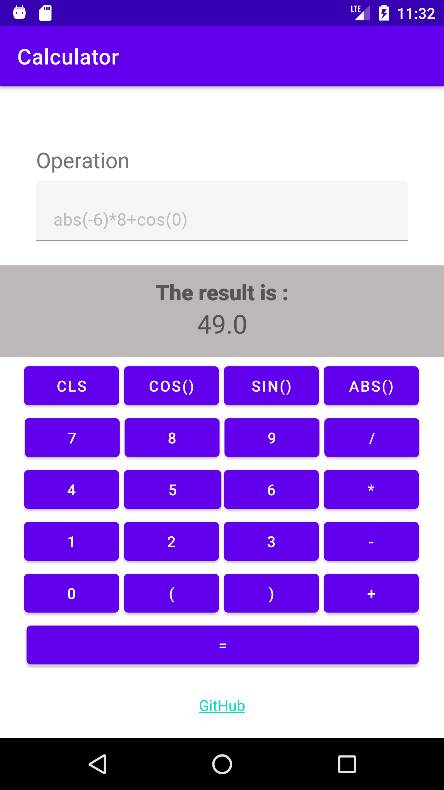
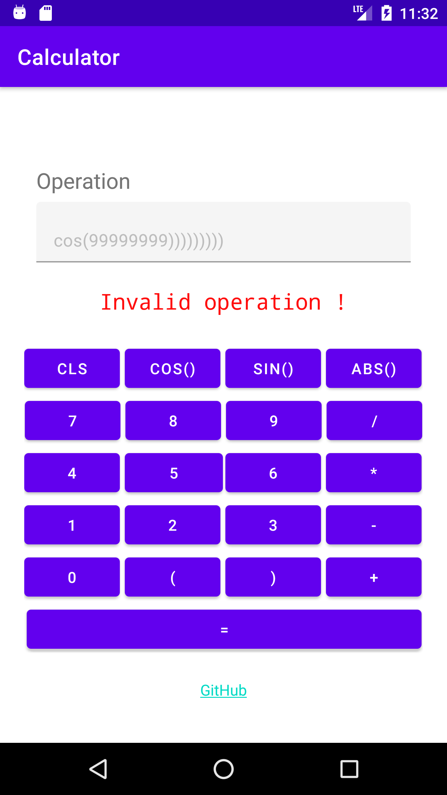

# TP 2 : calculate an inline mathematical operation

- is almost same as [the example before](https://github.com/ubmagh/mobile-dev-tps/tree/main/TP1), except that buttons have been added in this one.

  |----| 

- [exp4j](https://www.objecthunter.net/exp4j/) is used to evaluate the string entred by the user.
