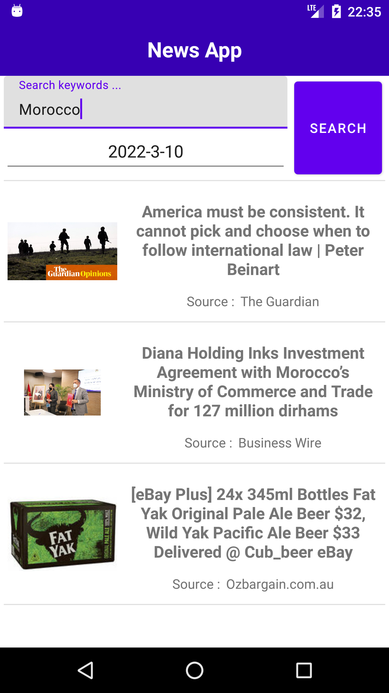
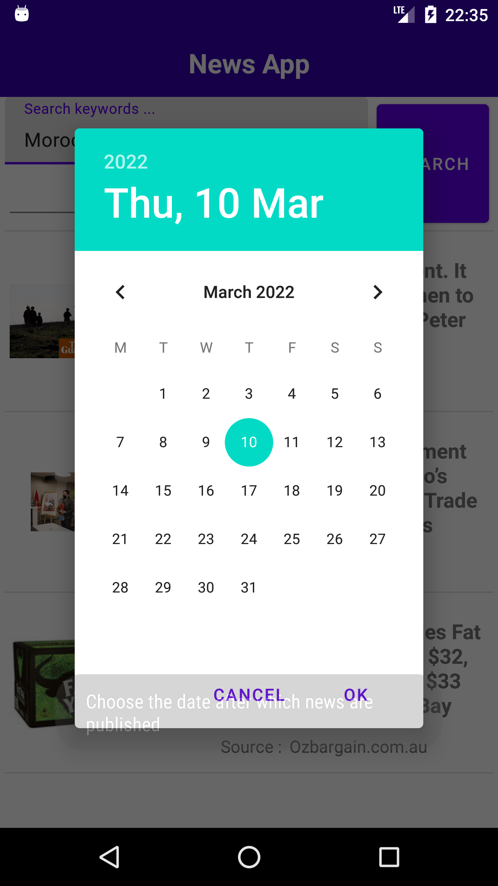

# TP 3 :  use a public API to fetch news, Filtered by keyword & publishing date

- Simple Rest APi fetching app, it fetches news (with a keyword & date filters ) from a [public api](https://newsapi.org/) and then shows them.

  |----|   |----|   |----|   |----| 

- Structure of the fetched data : 

