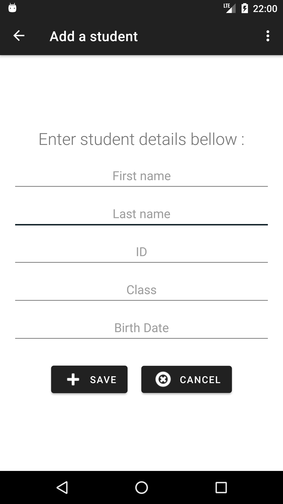
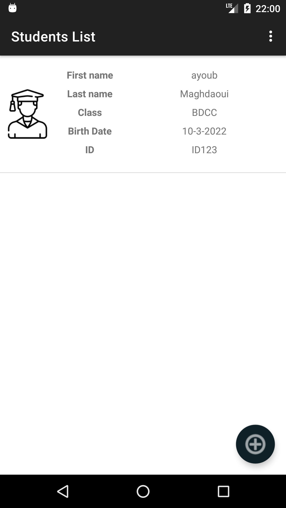
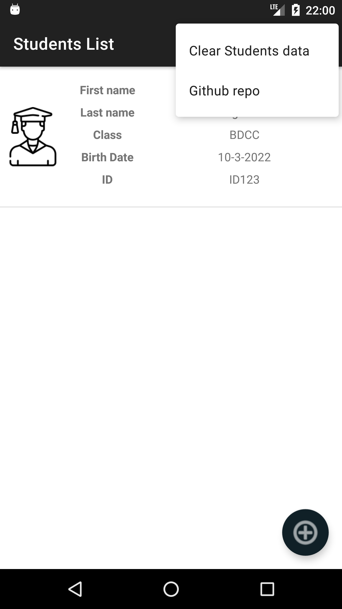

# TP 4 : store data on local files

- simple app that stores managed-Students-data in a serialized manner on a local file.

- In the app :
    - using of fragments
    - communication between fragments uses ViewModel
    - Serialization / Deserialization

  |----|   |----|  |----|

