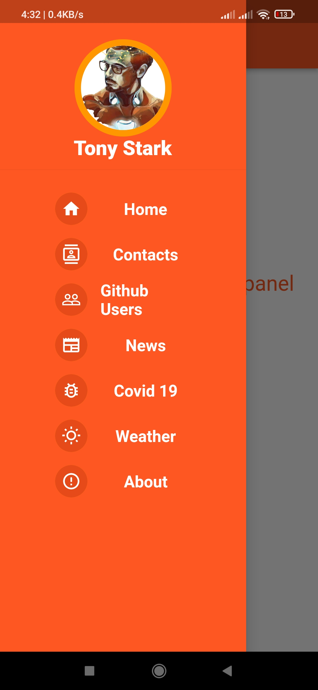
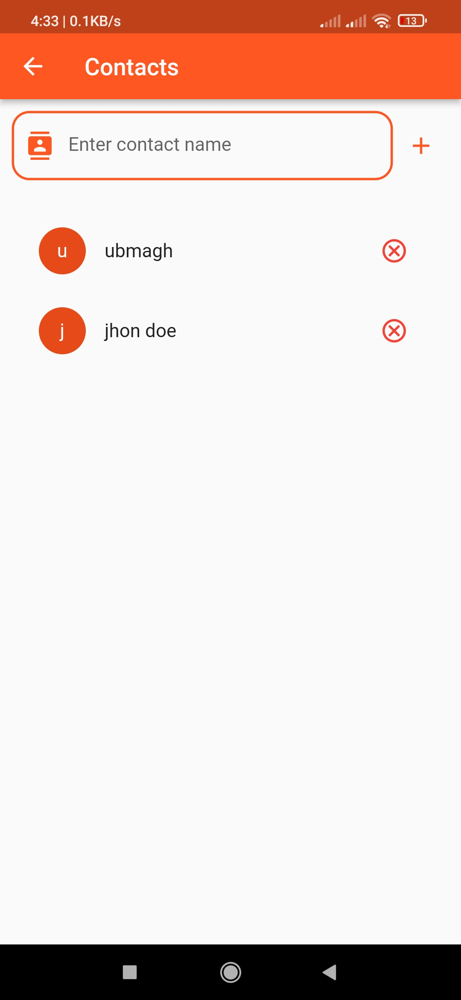
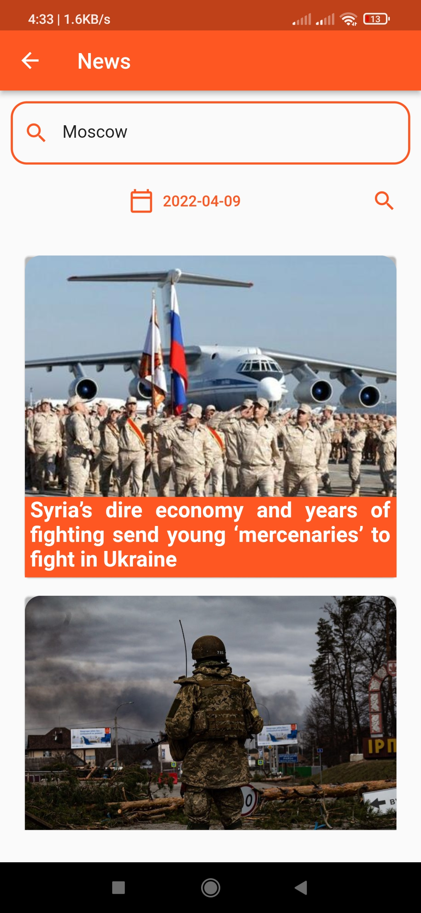
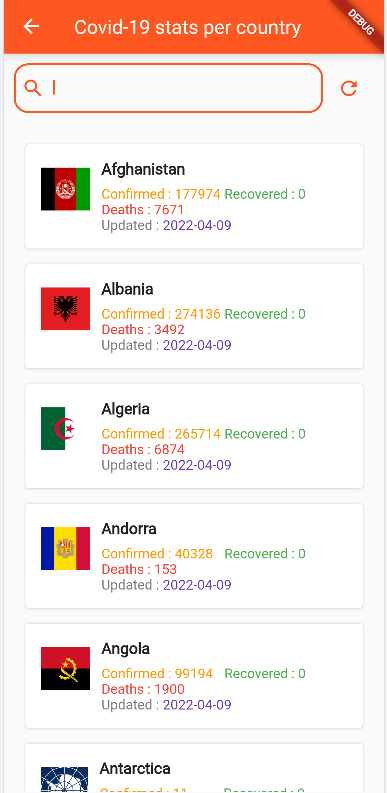
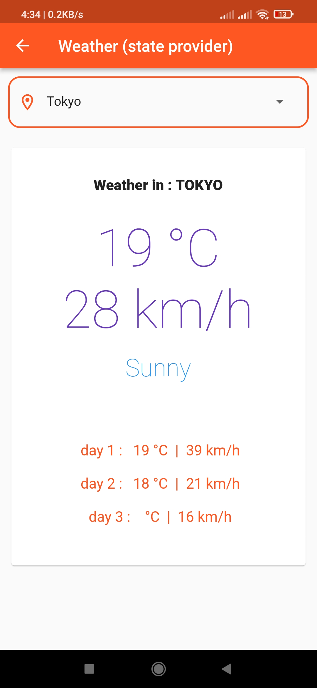

# tp7_apps

A set of apps, built when i was discouvering flutter, things i learned ;
consuming rest apis, discovering navigation , routing & Globale state using ChangeNotifier

 

## Used APIs :

* weather-api : https://github.com/robertoduessmann/weather-api

* Covid-19 api : https://github.com/M-Media-Group/Covid-19-API

* news Api : https://newsapi.org/v2/

## packages ;

>http:
>
>fluttertoast:
>
>url_launcher:
>
>country_icons:
>
>provider:

 

### Screens ;

<table>
    <tbody>
        <tr>
            <td> </td>
            <td> </td>
        </tr>
        <tr>
            <td> </td>
            <td> </td>
        </tr>
        <tr>
            <td> </td>
            <td> </td>
        </tr>
        <tr>
            <td> </td>
            <td> </td>
        </tr>
    </tbody>
</table>
